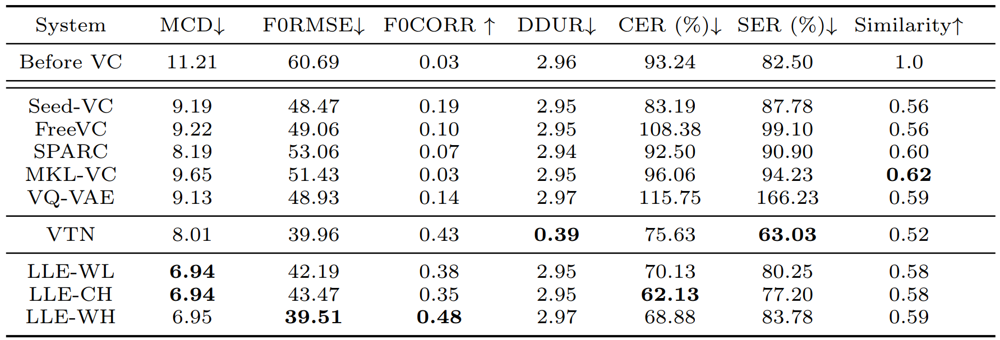
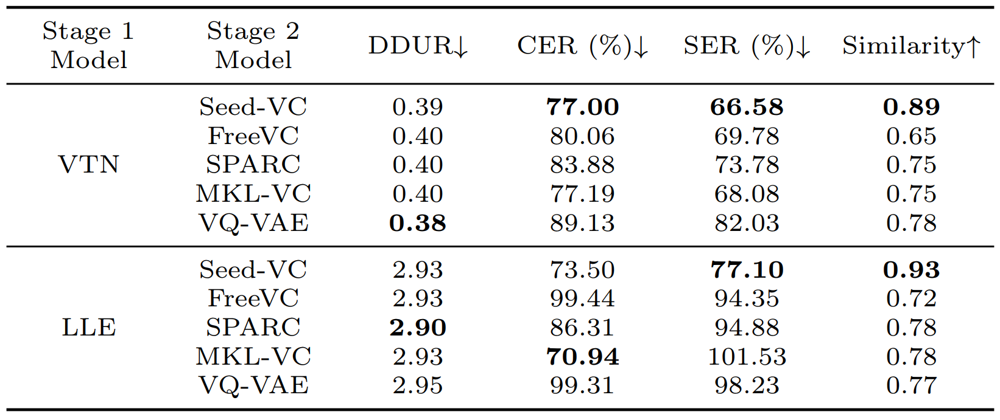

# Two-stage Voice Conversion for Dysarthric Speech Reconstruction with Speaker Identity Preservation

## Abstact

Dysarthria, a speech disorder that hinders speech production, can cause difficulties in daily communication for patients. To assist dysarthric patients, voice conversion (VC) methods for dysarthric speech reconstruction (DSR) have been implemented to improve the intelligibility of dysarthric speech. Despite the success of various VC methods, the identity of the dysarthric speaker is often lost during conversion. In this study, we proposed a two-stage VC framework. For Stage 1, we evaluated the ability of a sequence-to-sequence Voice Transformer Network (VTN) and a locally linear embedding (LLE)-based VC model to enhance speech intelligibility by converting dysarthric speech to four normal reference speakers. We tested the LLE conversion with different types of content features (Chinese-HuBERT, WavLM, and Whisper). For Stage 2, we investigated four state-of-the-art models for restoring speaker identity (Seed-VC, FreeVC, SPARC, and MKL-VC) and compared them with a previously tested vector-quantized variational autoencoder (VQ-VAE) baseline model. Our evaluation found that the VTN and LLE models using Chinese-HuBERT as content features achieved the most significant improvements in intelligibility. Furthermore, Seed-VC considerably outperformed the other state-of-the-art models and the baseline in preserving speaker similarity without sacrificing intelligibility, especially when applied to VTN results.

## Model

* LLE: Locally Linear Embedding with content features extracted from the last layer of one of the models below:
    - WavLM Large
    - Chinese-HuBERT Large
    - Whisper Large V3
* VTN: a sequence-to-sequence (seq2seq) model with text-to-speech (TTS) model trained on Sinica-COSPRO dataset and Voice Transformer Network (VTN) based on ESPnet
* Seed-VC: Seed-VC v1, a zero-shot VC diffusion network 
* FreeVC: High-quality text-free one-shot VC model
* SPARC: Speech articulatory coding model
* MKL-VC: a training-free modified version of kNN-VC that utilizes factorized optimal transport map obtained from Monge-Kantorovich Linear (MKL) solution instead of kNN regression
* VQ-VAE: a non-parallel frame-wise VC model based on vector-quantized variational autoencoder in the crank toolkit
* DY01: dysarthric speaker id
* SPXX: target TMSV speakers id (Male: SP04, SP09; Female: SP07, SP13)

## Objective evaluation

For speech intelligibility:
* MCD: Mel-cepstrum distortion
* CER: character error rate of Whisper ASR system
* SER: syllable error rate of ASR system

For F0 (Pitch):
* F0 RMSE: F0 root mean square error
* F0 CORR: F0 correlation coefficients

For duration:
* DDUR: average absolute duration difference between the converted and reference utterances

For speaker similarity:
* similarity: cosine similarity between the converted and reference utterances, calculated with a resemblyzer in the metrics tool in the Amphion toolkit

### Table 1: 

### Table 2: 

## Audio samples

### Stage 1: DSR 

#### DY01-SP04

**sample 1**

|   Model   | transcription: 他捐了很多衣物給災區 (ta juan le hen duo yi wu gei zai qu) |
|:---------:|:-------------------------------------------------------------------:|
| EL speech | <audio src="audio/el01/EL01_281.wav" controls preload></audio> |
| MT-CLDNN  | <audio src="audio/el01_nl01/mtcldnn/EL01-NL01_MTCLDNN_h5_GV_no0th_281.wav" controls preload></audio> |
|    TFS    | <audio src="audio/el01_nl01/tfs/EL01-NL01_TFS_281.wav" controls preload></audio> |
|    PT     | <audio src="audio/el01_nl01/pt/EL01-NL01_PT_281.wav" controls preload></audio> |
| NL speech | <audio src="audio/nl01/NL01_281.wav" controls preload></audio> |

**sample 2**

|   Model   |transcription: 我把不用的家具送人了 (wo ba bu yong de jia ju song ren le)|
|:---------:|:-------------------------------------------------------------------:|
| EL speech | <audio src="audio/el01/EL01_284.wav" controls preload></audio> |
| MT-CLDNN  | <audio src="audio/el01_nl01/mtcldnn/EL01-NL01_MTCLDNN_h5_GV_no0th_284.wav" controls preload></audio> |
|    TFS    | <audio src="audio/el01_nl01/tfs/EL01-NL01_TFS_284.wav" controls preload></audio> |
|    PT     | <audio src="audio/el01_nl01/pt/EL01-NL01_PT_284.wav" controls preload></audio> |
| NL speech | <audio src="audio/nl01/NL01_284.wav" controls preload></audio> |

**sample 3**

|   Model   | transcription: 那個牆上掛著一幅油畫 (na ge qiang shang gua zhu yi fu you hua)|
|:---------:|:-------------------------------------------------------------------:|
| EL speech | <audio src="audio/el01/EL01_287.wav" controls preload></audio> |
| MT-CLDNN  | <audio src="audio/el01_nl01/mtcldnn/EL01-NL01_MTCLDNN_h5_GV_no0th_287.wav" controls preload></audio> |
|    TFS    | <audio src="audio/el01_nl01/tfs/EL01-NL01_TFS_287.wav" controls preload></audio> |
|    PT     | <audio src="audio/el01_nl01/pt/EL01-NL01_PT_287.wav" controls preload></audio> |
| NL speech | <audio src="audio/nl01/NL01_287.wav" controls preload></audio> |

### Pair EL01-NL02

**sample 1**

|   Model   | transcription: 他捐了很多衣物給災區 (ta juan le hen duo yi wu gei zai qu) |
|:---------:|:-------------------------------------------------------------------:|
| EL speech | <audio src="audio/el01/EL01_281.wav" controls preload></audio> |
| MT-CLDNN  | <audio src="audio/el01_nl02/mtcldnn/EL01-NL02_MTCLDNN_h5_GV_no0th_281.wav" controls preload></audio> |
|    TFS    | <audio src="audio/el01_nl02/tfs/EL01-NL02_TFS_281.wav" controls preload></audio> |
|    PT     | <audio src="audio/el01_nl02/pt/EL01-NL02_PT_281.wav" controls preload></audio> |
| NL speech | <audio src="audio/nl02/NL02_281.wav" controls preload></audio> |

**sample 2**

|   Model   |transcription: 我幫他把雞蛋放入冰箱 (wo bang ta ba ji dan fang ru bing xiang)|
|:---------:|:-------------------------------------------------------------------:|
| EL speech | <audio src="audio/el01/EL01_285.wav" controls preload></audio> |
| MT-CLDNN  | <audio src="audio/el01_nl02/mtcldnn/EL01-NL02_MTCLDNN_h5_GV_no0th_285.wav" controls preload></audio> |
|    TFS    | <audio src="audio/el01_nl02/tfs/EL01-NL02_TFS_285.wav" controls preload></audio> |
|    PT     | <audio src="audio/el01_nl02/pt/EL01-NL02_PT_285.wav" controls preload></audio> |
| NL speech | <audio src="audio/nl02/NL02_285.wav" controls preload></audio> |

**sample 3**

|   Model   | transcription: 那個牆上掛著一幅油畫 (na ge qiang shang gua zhu yi fu you hua)|
|:---------:|:-------------------------------------------------------------------:|
| EL speech | <audio src="audio/el01/EL01_287.wav" controls preload></audio> |
| MT-CLDNN  | <audio src="audio/el01_nl02/mtcldnn/EL01-NL02_MTCLDNN_h5_GV_no0th_287.wav" controls preload></audio> |
|    TFS    | <audio src="audio/el01_nl02/tfs/EL01-NL02_TFS_287.wav" controls preload></audio> |
|    PT     | <audio src="audio/el01_nl02/pt/EL01-NL02_PT_287.wav" controls preload></audio> |
| NL speech | <audio src="audio/nl02/NL02_287.wav" controls preload></audio> |

## Reference

[^first]: K.  Kobayashi  and  T.  Toda,  “Implementation of low-latency electrolaryngeal speech enhancement based onmulti-task  cldnn,”  inProceedings of 2020 28th EU-SIPCO, 2021, pp. 396–400.

