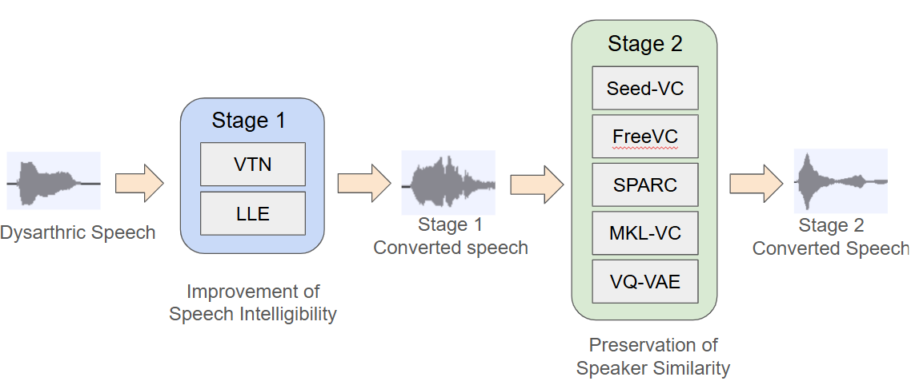

# Two-stage Voice Conversion for Dysarthric Speech Reconstruction with Speaker Identity Preservation

## Abstact

Dysarthria, a speech disorder that hinders speech production, can cause difficulties in daily communication for patients. To assist dysarthric patients, voice conversion (VC) methods for dysarthric speech reconstruction (DSR) have been implemented to improve the intelligibility of dysarthric speech. Despite the success of various VC methods, the identity of the dysarthric speaker is often lost during conversion. In this study, we proposed a two-stage VC framework. For Stage 1, we evaluated the ability of a sequence-to-sequence Voice Transformer Network (VTN) and a locally linear embedding (LLE)-based VC model to enhance speech intelligibility by converting dysarthric speech to four normal reference speakers. We tested the LLE conversion with different types of content features (Chinese-HuBERT, WavLM, and Whisper). For Stage 2, we investigated four state-of-the-art models for restoring speaker identity (Seed-VC, FreeVC, SPARC, and MKL-VC) and compared them with a previously tested vector-quantized variational autoencoder (VQ-VAE) baseline model. Our evaluation found that the VTN and LLE models using Chinese-HuBERT as content features achieved the most significant improvements in intelligibility. Furthermore, Seed-VC considerably outperformed the other state-of-the-art models and the baseline in preserving speaker similarity without sacrificing intelligibility, especially when applied to VTN results.

## VC Approaches

* LLE[^first]: Locally Linear Embedding with content features extracted from the last layer of one of the models below:
    - WavLM Large (WL)
    - Chinese-HuBERT Large (CH)
    - Whisper Large V3 (WH)
* VTN: : a sequence-to-sequence (seq2seq) model[^second] with text-to-speech (TTS) model trained on Sinica-COSPRO dataset and Voice Transformer Network (VTN) based on ESPnet
* Seed-VC[^third]: : Seed-VC v1, a zero-shot VC diffusion network 
* FreeVC[^fourth]: High-quality text-free one-shot VC model
* SPARC[^fifth]: Speech articulatory coding model
* MKL-VC[^sixth]: a training-free modified version of kNN-VC that utilizes factorized optimal transport map obtained from Monge-Kantorovich Linear (MKL) solution instead of kNN regression
* VQ-VAE (crank[^seventh]): a non-parallel frame-wise VC model based on vector-quantized variational autoencoder in the crank toolkit
* VTN+VQVAE: the baseline used in our experiment, which is based on previous two-stage DSR experiment[^eighth]
* DY01: dysarthric speaker id
* SPXX: TMSV speakers id (Male: SP04, SP09; Female: SP07, SP13)

## Illustration of the implemented two-stage VC method for DSR

## Objective evaluation

For speech intelligibility:
* MCD: Mel-cepstrum distortion
* CER: character error rate of Whisper ASR system
* SER: syllable error rate of ASR system

For F0 (Pitch):
* F0 RMSE: F0 root mean square error
* F0 CORR: F0 correlation coefficients

For duration:
* DDUR: average absolute duration difference between the converted and reference utterances

For speaker similarity:
* similarity: cosine similarity between the converted and reference utterances, calculated with a resemblyzer in the metrics tool in the Amphion toolkit

### Table 1: Evaluation of Stage 1 DSR results for VTN, LLE with different content features(WL, CH, WH) , and second-stage VC methods.

### Table 2: Evaluation of two-stage VC for DSR with different Stage 2 frame-wise VC models.

## Audio samples

### Stage 1: DSR 

* source speech: speech from DY01
* target speech: speech from SP04, SP09, SP07, SP13
* For the tables below, the rows are the systems implemented, and the columns are the target speakers used for conversion.

**sample 1**

* transcription: 他捐了很多衣物給災區 (ta juan le hen duo yi wu gei zai qu)

|   System  |        SP04        |        SP09         |        SP07         |        SP13         |
|:---------:|:------------------:|:-------------------:|:-------------------:|:-------------------:|
| Before VC | <audio src="audio/DY01/DY01_281.wav" controls preload></audio> | <audio src="audio/DY01/DY01_281.wav" controls preload></audio> | <audio src="audio/DY01/DY01_281.wav" controls preload></audio> | <audio src="audio/DY01/DY01_281.wav" controls preload></audio> |
| Target speech | <audio src="audio/SP04/SP04_281.wav" controls preload></audio> | <audio src="audio/SP09/SP09_281.wav" controls preload></audio> | <audio src="audio/SP07/SP07_281.wav" controls preload></audio> | <audio src="audio/SP13/SP13_281.wav" controls preload></audio> |
|===========|====================|====================|====================|====================|
|  Seed-VC  | <audio src="audio/lab2-1-0_seedvc_DY01-SP04/lab2-1-0_seedvc_DY01-SP04_281.wav" controls preload></audio> | <audio src="audio/lab2-1-0_seedvc_DY01-SP09/lab2-1-0_seedvc_DY01-SP09_281.wav" controls preload></audio> | <audio src="audio/lab2-1-0_seedvc_DY01-SP07/lab2-1-0_seedvc_DY01-SP07_281.wav" controls preload></audio> | <audio src="audio/lab2-1-0_seedvc_DY01-SP13/lab2-1-0_seedvc_DY01-SP13_281.wav" controls preload></audio> |
|  FreeVC   | <audio src="audio/lab2-1-0_freevc_DY01-SP04/lab2-1-0_freevc_DY01-SP04_281.wav" controls preload></audio> | <audio src="audio/lab2-1-0_freevc_DY01-SP09/lab2-1-0_freevc_DY01-SP09_281.wav" controls preload></audio> |<audio src="audio/lab2-1-0_freevc_DY01-SP07/lab2-1-0_freevc_DY01-SP07_281.wav" controls preload></audio> | <audio src="audio/lab2-1-0_freevc_DY01-SP13/lab2-1-0_freevc_DY01-SP13_281.wav" controls preload></audio> |
|  SPARC    | <audio src="audio/lab2-1-0_sparc_DY01-SP04/lab2-1-0_sparc_DY01-SP04_281.wav" controls preload></audio> | <audio src="audio/lab2-1-0_sparc_DY01-SP09/lab2-1-0_sparc_DY01-SP09_281.wav" controls preload></audio> | <audio src="audio/lab2-1-0_sparc_DY01-SP07/lab2-1-0_sparc_DY01-SP07_281.wav" controls preload></audio> | <audio src="audio/lab2-1-0_sparc_DY01-SP13/lab2-1-0_sparc_DY01-SP13_281.wav" controls preload></audio> |
|  MKL-VC   | <audio src="audio/lab2-1-0_mklvc_DY01-SP04/lab2-1-0_mklvc_DY01-SP04_281.wav" controls preload></audio> | <audio src="audio/lab2-1-0_mklvc_DY01-SP09/lab2-1-0_mklvc_DY01-SP09_281.wav" controls preload></audio> | <audio src="audio/lab2-1-0_mklvc_DY01-SP07/lab2-1-0_mklvc_DY01-SP07_281.wav" controls preload></audio> | <audio src="audio/lab2-1-0_mklvc_DY01-SP13/lab2-1-0_mklvc_DY01-SP13_281.wav" controls preload></audio> |
|  VQ-VAE   | <audio src="audio/lab2-1-0_vqvae_DY01-SP04/lab2-1-0_vqvae_DY01-SP04_281.wav" controls preload></audio> | <audio src="audio/lab2-1-0_vqvae_DY01-SP09/lab2-1-0_vqvae_DY01-SP09_281.wav" controls preload></audio> | <audio src="audio/lab2-1-0_vqvae_DY01-SP07/lab2-1-0_vqvae_DY01-SP07_281.wav" controls preload></audio> | <audio src="audio/lab2-1-0_vqvae_DY01-SP13/lab2-1-0_vqvae_DY01-SP13_281.wav" controls preload></audio> |
|===========|====================|====================|====================|====================|
|  VTN      | <audio src="audio/lab1-2_VTN_DY01-SP04/lab1-2_VTN_DY01-SP04_281.wav" controls preload></audio> | <audio src="audio/lab1-2_VTN_DY01-SP09/lab1-2_VTN_DY01-SP09_281.wav" controls preload></audio> | <audio src="audio/lab1-2_VTN_DY01-SP07/lab1-2_VTN_DY01-SP07_281.wav" controls preload></audio> | <audio src="audio/lab1-2_VTN_DY01-SP13/lab1-2_VTN_DY01-SP13_281.wav" controls preload></audio> |
|===========|====================|====================|====================|====================|
|  LLE-WL   | <audio src="audio/lab1-1_wavlm_DY01-SP04/lab1-1_wavlm_DY01-SP04_281.wav" controls preload></audio> | <audio src="audio/lab1-1_wavlm_DY01-SP09/lab1-1_wavlm_DY01-SP09_281.wav" controls preload></audio> | <audio src="audio/lab1-1_wavlm_DY01-SP07/lab1-1_wavlm_DY01-SP07_281.wav" controls preload></audio> | <audio src="audio/lab1-1_wavlm_DY01-SP13/lab1-1_wavlm_DY01-SP13_281.wav" controls preload></audio> |
|  LLE-CH   | <audio src="audio/lab1-1_cnhu_DY01-SP04/lab1-1_cnhu_DY01-SP04_281.wav" controls preload></audio> | <audio src="audio/lab1-1_cnhu_DY01-SP09/lab1-1_cnhu_DY01-SP09_281.wav" controls preload></audio> | <audio src="audio/lab1-1_cnhu_DY01-SP07/lab1-1_cnhu_DY01-SP07_281.wav" controls preload></audio> | <audio src="audio/lab1-1_cnhu_DY01-SP13/lab1-1_cnhu_DY01-SP13_281.wav" controls preload></audio> |
|  LLE-WH   | <audio src="audio/lab1-1_whisper_DY01-SP04/lab1-1_whisper_DY01-SP04_281.wav" controls preload></audio> | <audio src="audio/lab1-1_whisper_DY01-SP09/lab1-1_whisper_DY01-SP09_281.wav" controls preload></audio> | <audio src="audio/lab1-1_whisper_DY01-SP07/lab1-1_whisper_DY01-SP07_281.wav" controls preload></audio> | <audio src="audio/lab1-1_whisper_DY01-SP13/lab1-1_whisper_DY01-SP13_281.wav" controls preload></audio> |

**sample 2**

* transcription: 電視報導那裡發生地震 (dian shi bao dao na li fa sheng di zhen)

|   System  |      SP04     |        SP09    |    SP07       |      SP13     |
|:---------:|:------------------:|:------------------:|:------------------:|:------------------:|
| Before VC | <audio src="audio/DY01/DY01_282.wav" controls preload></audio> | <audio src="audio/DY01/DY01_282.wav" controls preload></audio> | <audio src="audio/DY01/DY01_282.wav" controls preload></audio> | <audio src="audio/DY01/DY01_282.wav" controls preload></audio> |
| Target speech | <audio src="audio/SP04/SP04_282.wav" controls preload></audio> | <audio src="audio/SP09/SP09_282.wav" controls preload></audio> | <audio src="audio/SP07/SP07_282.wav" controls preload></audio> | <audio src="audio/SP13/SP13_282.wav" controls preload></audio> |
|===========|====================|====================|====================|====================|
|  Seed-VC  | <audio src="audio/lab2-1-0_seedvc_DY01-SP04/lab2-1-0_seedvc_DY01-SP04_282.wav" controls preload></audio> | <audio src="audio/lab2-1-0_seedvc_DY01-SP09/lab2-1-0_seedvc_DY01-SP09_282.wav" controls preload></audio> | <audio src="audio/lab2-1-0_seedvc_DY01-SP07/lab2-1-0_seedvc_DY01-SP07_282.wav" controls preload></audio> | <audio src="audio/lab2-1-0_seedvc_DY01-SP13/lab2-1-0_seedvc_DY01-SP13_282.wav" controls preload></audio> |
|  FreeVC   | <audio src="audio/lab2-1-0_freevc_DY01-SP04/lab2-1-0_freevc_DY01-SP04_282.wav" controls preload></audio> | <audio src="audio/lab2-1-0_freevc_DY01-SP09/lab2-1-0_freevc_DY01-SP09_282.wav" controls preload></audio> |<audio src="audio/lab2-1-0_freevc_DY01-SP07/lab2-1-0_freevc_DY01-SP07_282.wav" controls preload></audio> | <audio src="audio/lab2-1-0_freevc_DY01-SP13/lab2-1-0_freevc_DY01-SP13_282.wav" controls preload></audio> |
|  SPARC    | <audio src="audio/lab2-1-0_sparc_DY01-SP04/lab2-1-0_sparc_DY01-SP04_282.wav" controls preload></audio> | <audio src="audio/lab2-1-0_sparc_DY01-SP09/lab2-1-0_sparc_DY01-SP09_282.wav" controls preload></audio> | <audio src="audio/lab2-1-0_sparc_DY01-SP07/lab2-1-0_sparc_DY01-SP07_282.wav" controls preload></audio> | <audio src="audio/lab2-1-0_sparc_DY01-SP13/lab2-1-0_sparc_DY01-SP13_282.wav" controls preload></audio> |
|  MKL-VC   | <audio src="audio/lab2-1-0_mklvc_DY01-SP04/lab2-1-0_mklvc_DY01-SP04_282.wav" controls preload></audio> | <audio src="audio/lab2-1-0_mklvc_DY01-SP09/lab2-1-0_mklvc_DY01-SP09_282.wav" controls preload></audio> | <audio src="audio/lab2-1-0_mklvc_DY01-SP07/lab2-1-0_mklvc_DY01-SP07_282.wav" controls preload></audio> | <audio src="audio/lab2-1-0_mklvc_DY01-SP13/lab2-1-0_mklvc_DY01-SP13_282.wav" controls preload></audio> |
|  VQ-VAE   | <audio src="audio/lab2-1-0_vqvae_DY01-SP04/lab2-1-0_vqvae_DY01-SP04_282.wav" controls preload></audio> | <audio src="audio/lab2-1-0_vqvae_DY01-SP09/lab2-1-0_vqvae_DY01-SP09_282.wav" controls preload></audio> | <audio src="audio/lab2-1-0_vqvae_DY01-SP07/lab2-1-0_vqvae_DY01-SP07_282.wav" controls preload></audio> | <audio src="audio/lab2-1-0_vqvae_DY01-SP13/lab2-1-0_vqvae_DY01-SP13_282.wav" controls preload></audio> |
|===========|====================|====================|====================|====================|
|  VTN      | <audio src="audio/lab1-2_VTN_DY01-SP04/lab1-2_VTN_DY01-SP04_282.wav" controls preload></audio> | <audio src="audio/lab1-2_VTN_DY01-SP09/lab1-2_VTN_DY01-SP09_282.wav" controls preload></audio> | <audio src="audio/lab1-2_VTN_DY01-SP07/lab1-2_VTN_DY01-SP07_282.wav" controls preload></audio> | <audio src="audio/lab1-2_VTN_DY01-SP13/lab1-2_VTN_DY01-SP13_282.wav" controls preload></audio> |
|===========|====================|====================|====================|====================|
|  LLE-WL   | <audio src="audio/lab1-1_wavlm_DY01-SP04/lab1-1_wavlm_DY01-SP04_282.wav" controls preload></audio> | <audio src="audio/lab1-1_wavlm_DY01-SP09/lab1-1_wavlm_DY01-SP09_282.wav" controls preload></audio> | <audio src="audio/lab1-1_wavlm_DY01-SP07/lab1-1_wavlm_DY01-SP07_282.wav" controls preload></audio> | <audio src="audio/lab1-1_wavlm_DY01-SP13/lab1-1_wavlm_DY01-SP13_282.wav" controls preload></audio> |
|  LLE-CH   | <audio src="audio/lab1-1_cnhu_DY01-SP04/lab1-1_cnhu_DY01-SP04_282.wav" controls preload></audio> | <audio src="audio/lab1-1_cnhu_DY01-SP09/lab1-1_cnhu_DY01-SP09_282.wav" controls preload></audio> | <audio src="audio/lab1-1_cnhu_DY01-SP07/lab1-1_cnhu_DY01-SP07_282.wav" controls preload></audio> | <audio src="audio/lab1-1_cnhu_DY01-SP13/lab1-1_cnhu_DY01-SP13_282.wav" controls preload></audio> |
|  LLE-WH   | <audio src="audio/lab1-1_whisper_DY01-SP04/lab1-1_whisper_DY01-SP04_282.wav" controls preload></audio> | <audio src="audio/lab1-1_whisper_DY01-SP09/lab1-1_whisper_DY01-SP09_282.wav" controls preload></audio> | <audio src="audio/lab1-1_whisper_DY01-SP07/lab1-1_whisper_DY01-SP07_282.wav" controls preload></audio> | <audio src="audio/lab1-1_whisper_DY01-SP13/lab1-1_whisper_DY01-SP13_282.wav" controls preload></audio> |

### Stage 2: Speaker similarity perservation with frame-wise VC models

* source speech: VTN-converted and LLE-converted speech from Stage 1
* target speech: speech from DY01
* For the tables below, the rows are the Stage 1/Stage 2 models used, and the columns are the source-target speaker pairs in Stage 1 conversion for which the converted results were used as source speech in Stage 2. 

**sample 1**

* transcription: 他捐了很多衣物給災區 (ta juan le hen duo yi wu gei zai qu)

| Stage 1 Model  |   Stage 2 Model   | DY01-SP04  |    DY01-SP09   |    DY01-SP07     |    DY01-SP13   |
|:--------------:|:-----------------:|:----------:|:----------:|:----------:|:----------:|
|VTN|  Seed-VC  | <audio src="audio/lab2-2-1_seedvc_DY01-SP04-DY01/lab2-2-1_seedvc_DY01-SP04-DY01_281.wav" controls preload></audio> | <audio src="audio/lab2-2-1_seedvc_DY01-SP09-DY01/lab2-2-1_seedvc_DY01-SP09-DY01_281.wav" controls preload></audio> | <audio src="audio/lab2-2-1_seedvc_DY01-SP07-DY01/lab2-2-1_seedvc_DY01-SP07-DY01_281.wav" controls preload></audio> | <audio src="audio/lab2-2-1_seedvc_DY01-SP13-DY01/lab2-2-1_seedvc_DY01-SP13-DY01_281.wav" controls preload></audio> |
|VTN|  FreeVC   | <audio src="audio/lab2-2-1_freevc_DY01-SP04-DY01/lab2-2-1_freevc_DY01-SP04-DY01_281.wav" controls preload></audio> | <audio src="audio/lab2-2-1_freevc_DY01-SP09-DY01/lab2-2-1_freevc_DY01-SP09-DY01_281.wav" controls preload></audio> | <audio src="audio/lab2-2-1_freevc_DY01-SP07-DY01/lab2-2-1_freevc_DY01-SP07-DY01_281.wav" controls preload></audio> | <audio src="audio/lab2-2-1_freevc_DY01-SP13-DY01/lab2-2-1_freevc_DY01-SP13-DY01_281.wav" controls preload></audio> |
|VTN|  SPARC    |  <audio src="audio/lab2-2-1_sparc_DY01-SP04-DY01/lab2-2-1_sparc_DY01-SP04-DY01_281.wav" controls preload></audio> | <audio src="audio/lab2-2-1_sparc_DY01-SP09-DY01/lab2-2-1_sparc_DY01-SP09-DY01_281.wav" controls preload></audio> | <audio src="audio/lab2-2-1_sparc_DY01-SP07-DY01/lab2-2-1_sparc_DY01-SP07-DY01_281.wav" controls preload></audio> | <audio src="audio/lab2-2-1_sparc_DY01-SP13-DY01/lab2-2-1_sparc_DY01-SP13-DY01_281.wav" controls preload></audio> |
|VTN|  MKL-VC   |  <audio src="audio/lab2-2-1_mklvc_DY01-SP04-DY01/lab2-2-1_mklvc_DY01-SP04-DY01_281.wav" controls preload></audio> | <audio src="audio/lab2-2-1_mklvc_DY01-SP09-DY01/lab2-2-1_mklvc_DY01-SP09-DY01_281.wav" controls preload></audio> | <audio src="audio/lab2-2-1_mklvc_DY01-SP07-DY01/lab2-2-1_mklvc_DY01-SP07-DY01_281.wav" controls preload></audio> | <audio src="audio/lab2-2-1_mklvc_DY01-SP13-DY01/lab2-2-1_mklvc_DY01-SP13-DY01_281.wav" controls preload></audio> |
|VTN|  VQ-VAE   |  <audio src="audio/lab2-2-1_vqvae_DY01-SP04-DY01/lab2-2-1_vqvae_DY01-SP04-DY01_281.wav" controls preload></audio> | <audio src="audio/lab2-2-1_vqvae_DY01-SP09-DY01/lab2-2-1_vqvae_DY01-SP09-DY01_281.wav" controls preload></audio> | <audio src="audio/lab2-2-1_vqvae_DY01-SP07-DY01/lab2-2-1_vqvae_DY01-SP07-DY01_281.wav" controls preload></audio> | <audio src="audio/lab2-2-1_vqvae_DY01-SP13-DY01/lab2-2-1_vqvae_DY01-SP13-DY01_281.wav" controls preload></audio> |
|================|===================|============|============|============|============|
|LLE|  Seed-VC  | <audio src="audio/lab2-1-1_cnhu_seedvc_DY01-SP04-DY01/lab2-1-1_cnhu_seedvc_DY01-SP04-DY01_281.wav" controls preload></audio> | <audio src="audio/lab2-1-1_cnhu_seedvc_DY01-SP09-DY01/lab2-1-1_cnhu_seedvc_DY01-SP09-DY01_281.wav" controls preload></audio> | <audio src="audio/lab2-1-1_cnhu_seedvc_DY01-SP07-DY01/lab2-1-1_cnhu_seedvc_DY01-SP07-DY01_281.wav" controls preload></audio> | <audio src="audio/lab2-1-1_cnhu_seedvc_DY01-SP13-DY01/lab2-1-1_cnhu_seedvc_DY01-SP13-DY01_281.wav" controls preload></audio> |
|LLE|  FreeVC   | <audio src="audio/lab2-1-2_cnhu_freevc_DY01-SP04-DY01/lab2-1-2_cnhu_freevc_DY01-SP04-DY01_281.wav" controls preload></audio> | <audio src="audio/lab2-1-2_cnhu_freevc_DY01-SP09-DY01/lab2-1-2_cnhu_freevc_DY01-SP09-DY01_281.wav" controls preload></audio> | <audio src="audio/lab2-1-2_cnhu_freevc_DY01-SP07-DY01/lab2-1-2_cnhu_freevc_DY01-SP07-DY01_281.wav" controls preload></audio> | <audio src="audio/lab2-1-2_cnhu_freevc_DY01-SP13-DY01/lab2-1-2_cnhu_freevc_DY01-SP13-DY01_281.wav" controls preload></audio> |
|LLE|  SPARC    | <audio src="audio/lab2-1-3_cnhu_sparc_DY01-SP04-DY01/lab2-1-3_cnhu_sparc_DY01-SP04-DY01_281.wav" controls preload></audio> | <audio src="audio/lab2-1-3_cnhu_sparc_DY01-SP09-DY01/lab2-1-3_cnhu_sparc_DY01-SP09-DY01_281.wav" controls preload></audio> | <audio src="audio/lab2-1-3_cnhu_sparc_DY01-SP07-DY01/lab2-1-3_cnhu_sparc_DY01-SP07-DY01_281.wav" controls preload></audio> | <audio src="audio/lab2-1-3_cnhu_sparc_DY01-SP13-DY01/lab2-1-3_cnhu_sparc_DY01-SP13-DY01_281.wav" controls preload></audio> |
|LLE|  MKL-VC   | <audio src="audio/lab2-1-4_cnhu_mklvc_DY01-SP04-DY01/lab2-1-4_cnhu_mklvc_DY01-SP04-DY01_281.wav" controls preload></audio> | <audio src="audio/lab2-1-4_cnhu_mklvc_DY01-SP09-DY01/lab2-1-4_cnhu_mklvc_DY01-SP09-DY01_281.wav" controls preload></audio> | <audio src="audio/lab2-1-4_cnhu_mklvc_DY01-SP07-DY01/lab2-1-4_cnhu_mklvc_DY01-SP07-DY01_281.wav" controls preload></audio> | <audio src="audio/lab2-1-4_cnhu_mklvc_DY01-SP13-DY01/lab2-1-4_cnhu_mklvc_DY01-SP13-DY01_281.wav" controls preload></audio> |
|LLE|  VQ-VAE   | <audio src="audio/lab2-1-5_cnhu_vqvae_DY01-SP04-DY01/lab2-1-5_cnhu_vqvae_DY01-SP04-DY01_281.wav" controls preload></audio> | <audio src="audio/lab2-1-5_cnhu_vqvae_DY01-SP09-DY01/lab2-1-5_cnhu_vqvae_DY01-SP09-DY01_281.wav" controls preload></audio> | <audio src="audio/lab2-1-5_cnhu_vqvae_DY01-SP07-DY01/lab2-1-5_cnhu_vqvae_DY01-SP07-DY01_281.wav" controls preload></audio> | <audio src="audio/lab2-1-5_cnhu_vqvae_DY01-SP13-DY01/lab2-1-5_cnhu_vqvae_DY01-SP13-DY01_281.wav" controls preload></audio> |

**sample 2**

* transcription: 電視報導那裡發生地震 (dian shi bao dao na li fa sheng di zhen)

| Stage 1 Model  |   Stage 2 Model   | DY01-SP04  |    DY01-SP09   |    DY01-SP07     |    DY01-SP13   |
|:--------------:|:-----------------:|:----------:|:----------:|:----------:|:----------:|
|VTN|  Seed-VC  | <audio src="audio/lab2-2-1_seedvc_DY01-SP04-DY01/lab2-2-1_seedvc_DY01-SP04-DY01_282.wav" controls preload></audio> | <audio src="audio/lab2-2-1_seedvc_DY01-SP09-DY01/lab2-2-1_seedvc_DY01-SP09-DY01_282.wav" controls preload></audio> | <audio src="audio/lab2-2-1_seedvc_DY01-SP07-DY01/lab2-2-1_seedvc_DY01-SP07-DY01_282.wav" controls preload></audio> | <audio src="audio/lab2-2-1_seedvc_DY01-SP13-DY01/lab2-2-1_seedvc_DY01-SP13-DY01_282.wav" controls preload></audio> |
|VTN|  FreeVC   | <audio src="audio/lab2-2-1_freevc_DY01-SP04-DY01/lab2-2-1_freevc_DY01-SP04-DY01_282.wav" controls preload></audio> | <audio src="audio/lab2-2-1_freevc_DY01-SP09-DY01/lab2-2-1_freevc_DY01-SP09-DY01_282.wav" controls preload></audio> | <audio src="audio/lab2-2-1_freevc_DY01-SP07-DY01/lab2-2-1_freevc_DY01-SP07-DY01_282.wav" controls preload></audio> | <audio src="audio/lab2-2-1_freevc_DY01-SP13-DY01/lab2-2-1_freevc_DY01-SP13-DY01_282.wav" controls preload></audio> |
|VTN|  SPARC    |  <audio src="audio/lab2-2-1_sparc_DY01-SP04-DY01/lab2-2-1_sparc_DY01-SP04-DY01_282.wav" controls preload></audio> | <audio src="audio/lab2-2-1_sparc_DY01-SP09-DY01/lab2-2-1_sparc_DY01-SP09-DY01_282.wav" controls preload></audio> | <audio src="audio/lab2-2-1_sparc_DY01-SP07-DY01/lab2-2-1_sparc_DY01-SP07-DY01_282.wav" controls preload></audio> | <audio src="audio/lab2-2-1_sparc_DY01-SP13-DY01/lab2-2-1_sparc_DY01-SP13-DY01_282.wav" controls preload></audio> |
|VTN|  MKL-VC   |  <audio src="audio/lab2-2-1_mklvc_DY01-SP04-DY01/lab2-2-1_mklvc_DY01-SP04-DY01_282.wav" controls preload></audio> | <audio src="audio/lab2-2-1_mklvc_DY01-SP09-DY01/lab2-2-1_mklvc_DY01-SP09-DY01_282.wav" controls preload></audio> | <audio src="audio/lab2-2-1_mklvc_DY01-SP07-DY01/lab2-2-1_mklvc_DY01-SP07-DY01_282.wav" controls preload></audio> | <audio src="audio/lab2-2-1_mklvc_DY01-SP13-DY01/lab2-2-1_mklvc_DY01-SP13-DY01_282.wav" controls preload></audio> |
|VTN|  VQ-VAE   |  <audio src="audio/lab2-2-1_vqvae_DY01-SP04-DY01/lab2-2-1_vqvae_DY01-SP04-DY01_282.wav" controls preload></audio> | <audio src="audio/lab2-2-1_vqvae_DY01-SP09-DY01/lab2-2-1_vqvae_DY01-SP09-DY01_282.wav" controls preload></audio> | <audio src="audio/lab2-2-1_vqvae_DY01-SP07-DY01/lab2-2-1_vqvae_DY01-SP07-DY01_282.wav" controls preload></audio> | <audio src="audio/lab2-2-1_vqvae_DY01-SP13-DY01/lab2-2-1_vqvae_DY01-SP13-DY01_282.wav" controls preload></audio> |
|================|===================|============|============|============|============|
|LLE|  Seed-VC  | <audio src="audio/lab2-1-1_cnhu_seedvc_DY01-SP04-DY01/lab2-1-1_cnhu_seedvc_DY01-SP04-DY01_282.wav" controls preload></audio> | <audio src="audio/lab2-1-1_cnhu_seedvc_DY01-SP09-DY01/lab2-1-1_cnhu_seedvc_DY01-SP09-DY01_282.wav" controls preload></audio> | <audio src="audio/lab2-1-1_cnhu_seedvc_DY01-SP07-DY01/lab2-1-1_cnhu_seedvc_DY01-SP07-DY01_282.wav" controls preload></audio> | <audio src="audio/lab2-1-1_cnhu_seedvc_DY01-SP13-DY01/lab2-1-1_cnhu_seedvc_DY01-SP13-DY01_282.wav" controls preload></audio> |
|LLE|  FreeVC   | <audio src="audio/lab2-1-2_cnhu_freevc_DY01-SP04-DY01/lab2-1-2_cnhu_freevc_DY01-SP04-DY01_282.wav" controls preload></audio> | <audio src="audio/lab2-1-2_cnhu_freevc_DY01-SP09-DY01/lab2-1-2_cnhu_freevc_DY01-SP09-DY01_282.wav" controls preload></audio> | <audio src="audio/lab2-1-2_cnhu_freevc_DY01-SP07-DY01/lab2-1-2_cnhu_freevc_DY01-SP07-DY01_282.wav" controls preload></audio> | <audio src="audio/lab2-1-2_cnhu_freevc_DY01-SP13-DY01/lab2-1-2_cnhu_freevc_DY01-SP13-DY01_282.wav" controls preload></audio> |
|LLE|  SPARC    | <audio src="audio/lab2-1-3_cnhu_sparc_DY01-SP04-DY01/lab2-1-3_cnhu_sparc_DY01-SP04-DY01_282.wav" controls preload></audio> | <audio src="audio/lab2-1-3_cnhu_sparc_DY01-SP09-DY01/lab2-1-3_cnhu_sparc_DY01-SP09-DY01_282.wav" controls preload></audio> | <audio src="audio/lab2-1-3_cnhu_sparc_DY01-SP07-DY01/lab2-1-3_cnhu_sparc_DY01-SP07-DY01_282.wav" controls preload></audio> | <audio src="audio/lab2-1-3_cnhu_sparc_DY01-SP13-DY01/lab2-1-3_cnhu_sparc_DY01-SP13-DY01_282.wav" controls preload></audio> |
|LLE|  MKL-VC   | <audio src="audio/lab2-1-4_cnhu_mklvc_DY01-SP04-DY01/lab2-1-4_cnhu_mklvc_DY01-SP04-DY01_282.wav" controls preload></audio> | <audio src="audio/lab2-1-4_cnhu_mklvc_DY01-SP09-DY01/lab2-1-4_cnhu_mklvc_DY01-SP09-DY01_282.wav" controls preload></audio> | <audio src="audio/lab2-1-4_cnhu_mklvc_DY01-SP07-DY01/lab2-1-4_cnhu_mklvc_DY01-SP07-DY01_282.wav" controls preload></audio> | <audio src="audio/lab2-1-4_cnhu_mklvc_DY01-SP13-DY01/lab2-1-4_cnhu_mklvc_DY01-SP13-DY01_282.wav" controls preload></audio> |
|LLE|  VQ-VAE   | <audio src="audio/lab2-1-5_cnhu_vqvae_DY01-SP04-DY01/lab2-1-5_cnhu_vqvae_DY01-SP04-DY01_282.wav" controls preload></audio> | <audio src="audio/lab2-1-5_cnhu_vqvae_DY01-SP09-DY01/lab2-1-5_cnhu_vqvae_DY01-SP09-DY01_282.wav" controls preload></audio> | <audio src="audio/lab2-1-5_cnhu_vqvae_DY01-SP07-DY01/lab2-1-5_cnhu_vqvae_DY01-SP07-DY01_282.wav" controls preload></audio> | <audio src="audio/lab2-1-5_cnhu_vqvae_DY01-SP13-DY01/lab2-1-5_cnhu_vqvae_DY01-SP13-DY01_282.wav" controls preload></audio> |

## Mel-spectrograms

### Mel-spectrogram for dysarthric speech, normal speech, and VTN-converted/LLE-converted speech.

### Mel-spectrogram for VTN+VQVAE, VTN+Seed-VC, and LLE(with CH as content feature)+Seed-VC results. The spectrogram for normal speech is included as reference.

## Reference

[^first]: Li, F.R., Hwang, H.T., Yen, M.C., Lo, M.T., Tsao, Y., Wang, H.M.: Improving exemplar-based electrolaryngeal speech voice conversion via robust content representations. In: Proc. APSIPA (2025)
[^second]: Huang, W.C., Hayashi, T., Wu, Y.C., Kameoka, H., Toda, T.: Voice transformer network: Sequence-to-sequence voice conversion using transformer with text-to-speech pretraining. In: Proc. Interspeech. pp. 4676–4680 (2020)
[^third]: Seed-VC GitHub: https://github.com/Plachtaa/seed-vc
[^fourth]: FreeVC GitHub: https://github.com/OlaWod/FreeVC
[^fifth]: SPARC GitHub: https://github.com/Berkeley-Speech-Group/Speech-Articulatory-Coding
[^sixth]: MKL-VC GitHub: https://github.com/alobashev/mkl-vc
[^seventh]: Crank GitHub: https://github.com/k2kobayashi/crank
[^eighth]: Huang, W.C., Kobayashi, K., Peng, Y.H., Liu, C.F., Tsao, Y., Wang, H.m., Toda,
T.: A preliminary study of a two-stage paradigm for preserving speaker identity in
dysarthric voice conversion. In: Proc. ICASSP. pp. 1329–1333 (2021)

